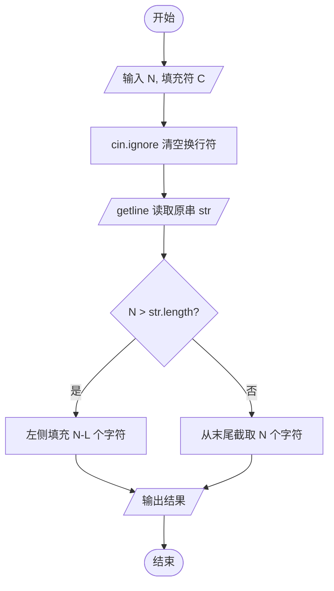

### 一、 算法思路

核心逻辑非常简单，就是比较**目标长度 $N$** 和**原串长度 $L$**：

1. **补齐（$N > L$）**：在原串左边拼上 $N - L$ 个填充字符。
2. **截断（$N \le L$）**：保留原串最后面的 $N$ 个字符（从索引 $L - N$ 截取到末尾）。

---

### 二、 为什么不能用 `cin`

1. **空格被吞**：
    * 它在遇到空格、制表符 (Tab) 或换行符时会停止读取，用 `getline` 才能把整行连空格一起读取。
2. **换行符残留**：
    * 读取了第一行的 `10 *` 之后，缓冲区里其实还剩下一个换行符 `\n`。
    * 如果没有 `cin.ignore()`，接下来的 `getline` 会直接读取这个 `\n`，导致读到的字符串是空的。